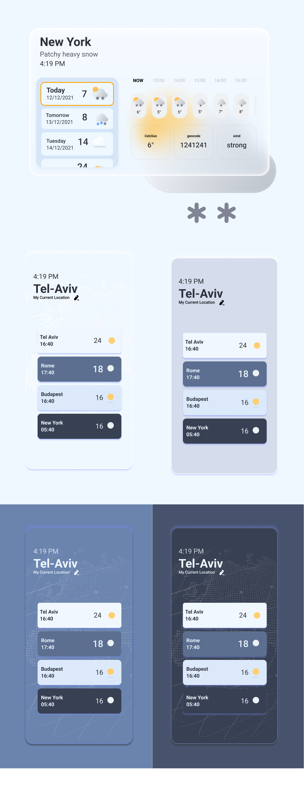

# Glassy Weather

[SITE URL](https://glassy-weather.netlify.app/)

Project structure
________________

-src
--assets    
---Components 
---Pages   
----Main
----Manage
---contextReducers
---Hooks
---SCSS
---utils 
---constants
```

[Design file 🔗](https://www.figma.com/file/p0IRC6SVcxFrRqwbfLtdMF/Weather-App?node-id=342%3A895)


